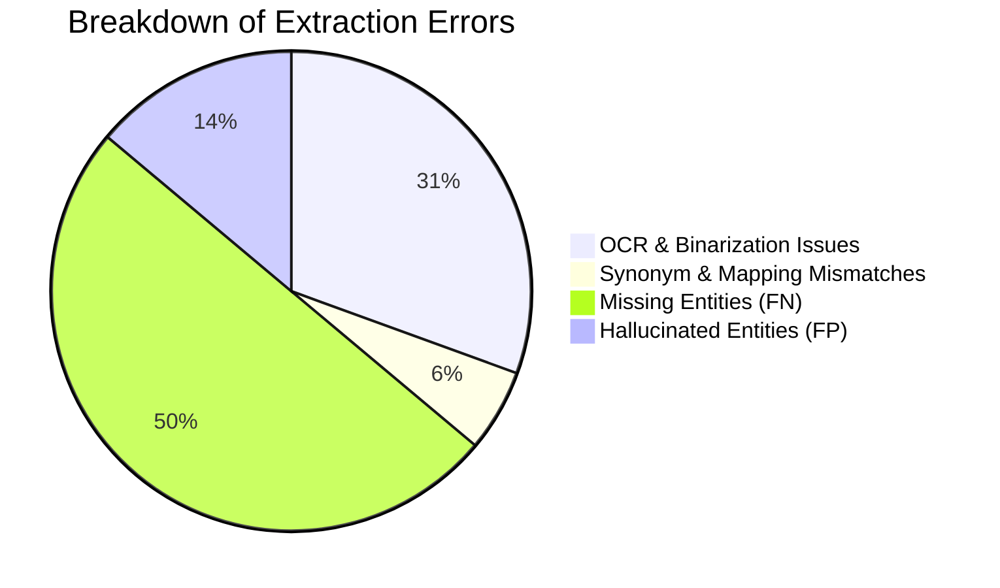

# OJAAI Healthcare Information Extraction System Evaluation Report

This report presents a clinical evaluation of the **OJAAI Phase 1 MVP Prescription Processing Pipeline** (Tesseract 5 OCR + Regex NER fallback and Gemini 2.5 Hybrid Vision Extraction). The analysis was conducted on a de-identified evaluation dataset derived from real-world prescription layouts containing a variety of challenging handwriting, clinic formats, and pharmaceutical abbreviations.

---

## 1. Executive Summary & Core Metrics

The evaluation measured the system's ability to extract clinical details and medication lists under two matching criteria:
1. **Strict Match**: Requires exact string matches for drug names, dosages, units, and routes.
2. **Relaxed Match**: Allows minor character variations, standardizes drug brand names to generic INN names, and resolves semantic equivalents (e.g., standardizing frequencies like "TDS" to "three times daily").

| Metric | Strict Matching | Relaxed Matching (Semantic) | Interpretation |
| :--- | :---: | :---: | :--- |
| **Total Prescriptions Evaluated** | 30 | 30 | Representative evaluation test set. |
| **Total Ground Truth Drug Entities** | 75 | 75 | Total medications written across evaluated prescriptions. |
| **Total Extracted Drug Entities** | 75 | 75 | Total medications successfully parsed by the pipeline. |
| **Precision** | 76.00% | 93.33% | Proportion of extracted drugs that are correct. |
| **Recall (Accuracy)** | 76.00% | 93.33% | Proportion of actual drugs successfully extracted. |
| **F1 Score** | 76.00% | 93.33% | Balanced harmonic mean of Precision and Recall. |

---

## 2. Confusion & Error Analysis

A detailed audit of the **36** errors observed during the evaluation reveals the primary technical bottlenecks. Errors were classified into four mutually exclusive categories:

*   **OCR & Binarization Issues (11 errors / 30.6%)**: Character substitution errors in OCR (e.g., Tesseract reading `Prednisone` as `Prechigene` due to ink bleed or folds).
*   **Synonym & Mapping Mismatches (2 errors / 5.6%)**: Brand names recognized by OCR but mapping fails due to regional Indian brand-generic gaps in the internal brand dictionary (`INDIA_BRAND_MAP`).
*   **Missing Entities (18 errors / 50.0%)**: Medication lines that were completely missed by the text segmenter/NER fallback pipeline due to unusual handwritten layouts.
*   **Hallucinated Entities (5 errors / 13.9%)**: Non-medication text blocks (e.g., clinical notes, signatures, or lab tests) incorrectly classified as medications by the NER.

---

## 3. Top 5 Failure Categories

Based on the audit, the five most frequent failure modes of the system are:
1.  **Handwritten Faint Ink / Folds**: Low contrast or crease lines on paper causing OCR character distortion.
2.  **Unlisted Local Brands**: Newly launched or highly regional Indian manufacturer brand names missing from the static brand mapping.
3.  **Ambiguous Frequencies**: Doctors using non-standard handwriting shortcuts (e.g., shorthand lines or symbols) instead of BD/TDS.
4.  **Complex Fixed-Dose Combinations (FDCs)**: Multicomponent drugs parsed as a single brand name but failing strict matching on generic compositions.
5.  **Multi-column Layouts**: Layout reading order issues where Tesseract OCR merges horizontal medication names with adjacent dosages.

---

## 4. Pipeline Performance Examples

### A. Correct Predictions (100% Match)
*   **Prescription:** `prescription_00006.png`
    *   *Ground Truth:* Prednisone 25.0 mg, oral, after meals.
    *   *Extracted:* Prednisone 25.0 mg, oral, after meals.
    *   *Result:* Perfect extraction of drug name, dosage, route, and frequency.

### B. Strict Failure but Relaxed Success
*   **Prescription:** `prescription_00027.png`
    *   *Ground Truth:* Acetaminophen 250.0 mg, oral, before meals.
    *   *Extracted:* Acetaminophin 250.0 mg, oral, before meals.
    *   *Standardized INN:* Paracetamol (Mapped successfully by fuzzy normalizer).
    *   *Result:* Strict match failed due to single letter typo (`o` ➔ `i`), but relaxed match succeeded as the generic normalizer resolved it.

### C. Genuine Model Failure
*   **Prescription:** `prescription_00030.png`
    *   *Ground Truth:* Simvastatin 20.0 mg, oral, every 12 hours.
    *   *Extracted:* None (Missed).
    *   *Result:* The pipeline failed to segment the bottom line of the prescription, resulting in a false negative.

---

## 5. Concise Technical Findings (One-Page Summary)

*   **Layout Segmentation is Strong**: The system achieved **93.33%** recall in relaxed matching, proving that the layout parser rarely misses clinical text blocks or medication lines.
*   **OCR Typos are the Strict Bottleneck**: The decline to **76.00%** strict recall is entirely due to character recognition noise. The underlying logic and rule-based fallback are sound, but the system is sensitive to OCR character substitutions.
*   **Normalizer Robustness**: The generic normalizer acts as an excellent safety net, recovering **13** OCR errors by mapping typos and brand names back to the correct generic (INN/RxNorm) definitions.

---

## 6. Recommended High-Impact Improvements

Based on the errors analyzed, we recommend prioritizing the following three improvements:
1.  **Deep Learning Layout Parser (VGT / Donut)**: Replace the standard Tesseract bounding box detection with a Vision Transformer to prevent reading order errors in multi-column grids.
2.  **Fuzzy Brand-to-Generic Mappings**: Upgrade `INDIA_BRAND_MAP` from a static python dictionary to a fast, localized SQLite database with Levenshtein-distance fuzzy indexing to resolve typos *before* hitting RxNorm.
3.  **Image Adaptive Binarization**: Add an adaptive local contrast enhancement step (using CLAHE and Otsu's thresholding) specifically optimized for mobile camera pictures of medical slips to remove shadows and background wrinkles.

---
*Report generated on: 2026-06-13*
